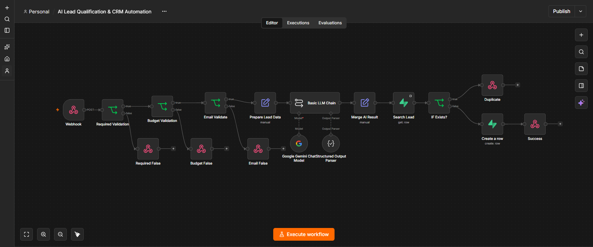
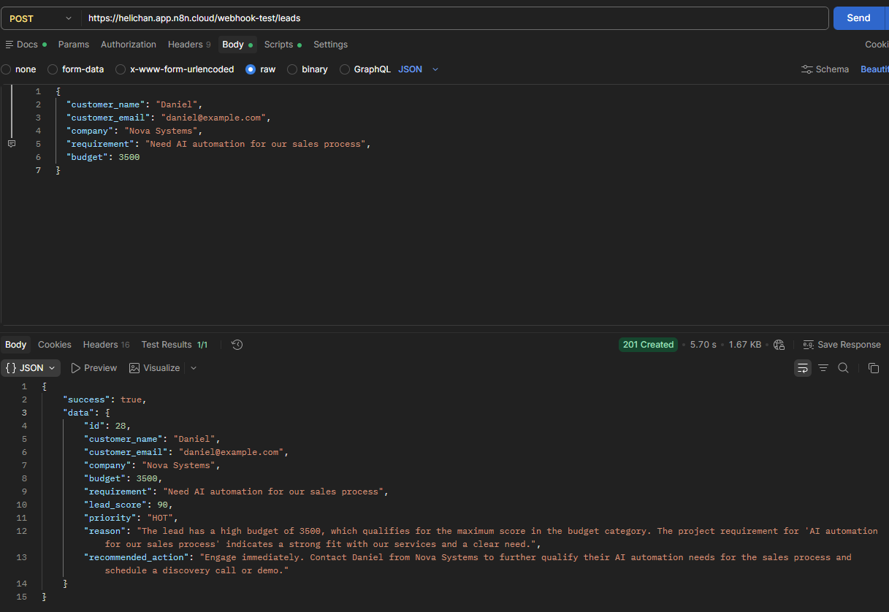
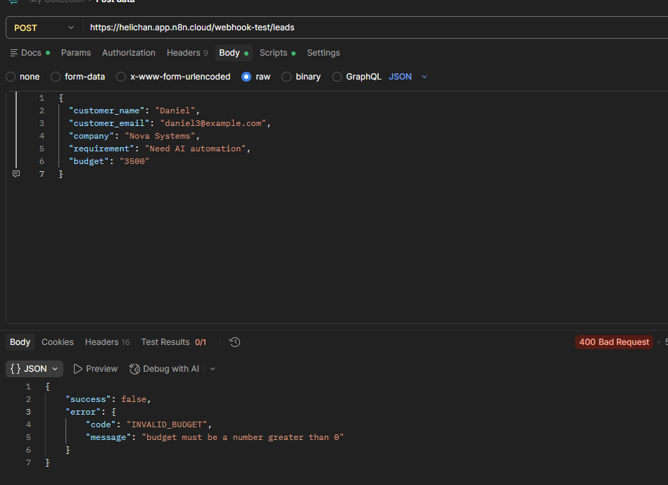
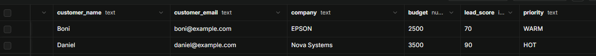

# AI Lead Qualification & CRM Automation System

AI-powered lead qualification and CRM automation built with **n8n, Google Gemini, and Supabase/PostgreSQL**.

## Overview

This project automates the initial lead qualification and CRM storage process.

Incoming leads are received through a REST webhook, validated, analyzed by Google Gemini, scored based on business rules, assigned a priority, checked for duplicates, and stored in Supabase/PostgreSQL.

The system is designed to reduce manual lead qualification, improve lead prioritization, and prevent duplicate CRM records.

---

## Problem

Sales teams can receive a large number of leads without a consistent qualification process.

Manual lead processing can result in:

- Slow response to new leads
- Inconsistent lead prioritization
- Duplicate CRM records
- Missed sales opportunities
- Manual and repetitive qualification work

---

## Solution

The system automates the lead processing pipeline from API request to CRM storage.

```text
Incoming Lead
      |
      v
n8n Webhook
      |
      v
Required Field Validation
      |
      v
Budget Validation
      |
      v
Email Validation
      |
      v
Prepare Lead Data
      |
      v
Google Gemini
      |
      v
Structured Output Parser
      |
      v
Merge AI Result
      |
      v
Search Existing Lead
      |
      v
IF Exists?
    /      \
  YES       NO
   |         |
   v         v
409       Create Row
Conflict      |
              v
         201 Created
```

---

## Architecture

The workflow is built as a sequence of validation, AI processing, data transformation, duplicate detection, and database operations.

### Workflow Components

#### 1. Webhook

Receives incoming lead data through an HTTP POST request.

Example request:

```json
{
  "customer_name": "Daniel",
  "customer_email": "daniel@example.com",
  "company": "Nova Systems",
  "requirement": "Need AI automation for our sales process",
  "budget": 3500
}
```

#### 2. Required Field Validation

The workflow validates that the following fields are present and not empty:

- `customer_name`
- `customer_email`
- `company`
- `requirement`
- `budget`

Invalid requests are rejected with HTTP `400 Bad Request`.

#### 3. Budget Validation

The workflow validates that:

- `budget` exists
- `budget` is a Number
- `budget` is greater than `0`

Examples:

```text
2500     → Valid
"2500"   → Invalid
0        → Invalid
-500     → Invalid
```

Invalid budget input returns HTTP `400 Bad Request`.

#### 4. Email Validation

The workflow validates the incoming email format before continuing to AI processing.

Invalid email input returns HTTP `400 Bad Request`.

#### 5. Prepare Lead Data

Validated webhook data is normalized into a consistent structure for downstream processing.

#### 6. Google Gemini

Google Gemini analyzes the incoming lead and generates:

- `lead_score`
- `priority`
- `reason`
- `recommended_action`

Example AI result:

```json
{
  "lead_score": 90,
  "priority": "HOT",
  "reason": "The lead has a high budget and a clear automation requirement.",
  "recommended_action": "Schedule discovery call."
}
```

#### 7. Structured Output Parser

The Gemini response is validated against a predefined JSON schema so downstream workflow nodes receive predictable structured data.

Expected AI structure:

```json
{
  "lead_score": 90,
  "priority": "HOT",
  "reason": "string",
  "recommended_action": "string"
}
```

#### 8. Merge AI Result

The workflow combines the original lead data with the AI-generated qualification result.

Example:

```json
{
  "customer_name": "Daniel",
  "customer_email": "daniel@example.com",
  "company": "Nova Systems",
  "requirement": "Need AI automation for our sales process",
  "budget": 3500,
  "lead_score": 90,
  "priority": "HOT",
  "reason": "The lead has a high budget and a clear automation requirement.",
  "recommended_action": "Schedule discovery call."
}
```

#### 9. Search Lead

The workflow searches the Supabase `leads` table using `customer_email`.

This determines whether the lead already exists.

#### 10. Duplicate Detection

If an existing lead is found, the workflow returns:

```text
HTTP 409 Conflict
```

Response:

```json
{
  "success": false,
  "error": {
    "code": "DUPLICATE_LEAD",
    "message": "Lead already exists"
  }
}
```

If the lead does not exist, the workflow proceeds to database insertion.

#### 11. Supabase / PostgreSQL

Valid leads are stored in the `leads` table.

Main fields:

```text
id
customer_name
customer_email
company
requirement
budget
lead_score
priority
reason
recommended_action
created_at
```

The database also uses a UNIQUE constraint on:

```text
customer_email
```

This provides an additional layer of protection against duplicate records.

---

## AI Qualification Logic

The AI qualification stage uses defined business rules to assign a lead score and priority.

### Scoring Rules

| Budget | Score |
|---|---:|
| >= 3000 | 90 |
| 1500 - 2999 | 70 |
| 500 - 1499 | 50 |
| < 500 | 30 |

### Priority Rules

| Score | Priority |
|---|---|
| 80 - 100 | HOT |
| 50 - 79 | WARM |
| 0 - 49 | COLD |

Example:

```text
Budget: 3500
    ↓
Lead Score: 90
    ↓
Priority: HOT
```

---

## API

### Endpoint

```text
POST /leads
```

### Content-Type

```text
application/json
```

### Request Body

```json
{
  "customer_name": "Daniel",
  "customer_email": "daniel@example.com",
  "company": "Nova Systems",
  "requirement": "Need AI automation for our sales process",
  "budget": 3500
}
```

---

## API Responses

### Successful Lead Creation

HTTP:

```text
201 Created
```

Example:

```json
{
  "success": true,
  "data": {
    "id": 28,
    "customer_name": "Daniel",
    "customer_email": "daniel@example.com",
    "company": "Nova Systems",
    "budget": 3500,
    "requirement": "Need AI automation for our sales process",
    "lead_score": 90,
    "priority": "HOT",
    "reason": "The lead has a high budget and a clear automation requirement.",
    "recommended_action": "Schedule discovery call."
  }
}
```

### Validation Error

HTTP:

```text
400 Bad Request
```

Example:

```json
{
  "success": false,
  "error": {
    "code": "VALIDATION_ERROR",
    "message": "customer_name, company, and requirement are required"
  }
}
```

### Invalid Email

HTTP:

```text
400 Bad Request
```

Example:

```json
{
  "success": false,
  "error": {
    "code": "INVALID_EMAIL",
    "message": "Invalid email format"
  }
}
```

### Invalid Budget

HTTP:

```text
400 Bad Request
```

Example:

```json
{
  "success": false,
  "error": {
    "code": "INVALID_BUDGET",
    "message": "budget must be a number greater than 0"
  }
}
```

### Duplicate Lead

HTTP:

```text
409 Conflict
```

Example:

```json
{
  "success": false,
  "error": {
    "code": "DUPLICATE_LEAD",
    "message": "Lead already exists"
  }
}
```

---

## Input Validation

The workflow validates incoming data before AI processing.

### Required Fields

The following fields are required:

```text
customer_name
customer_email
company
requirement
budget
```

### Budget Contract

The `budget` field must:

```text
Exist
↓
Be a Number
↓
Be greater than 0
```

### Email Contract

The `customer_email` field must contain a valid email format.

---

## Duplicate Protection

Duplicate protection exists at two levels.

### Application Layer

n8n searches for an existing lead using `customer_email` before creating a new record.

### Database Layer

Supabase/PostgreSQL enforces:

```text
UNIQUE(customer_email)
```

This protects the database even if an application-level duplicate check is bypassed.

---

## Testing

The workflow was tested using Postman and Supabase.

### Validation Tests

| Test Case | Expected Result |
|---|---|
| Valid lead | 201 Created |
| Invalid email | 400 Bad Request |
| Missing customer_name | 400 Bad Request |
| Missing company | 400 Bad Request |
| Missing requirement | 400 Bad Request |
| Budget as String | 400 Bad Request |
| Budget = 0 | 400 Bad Request |
| Negative budget | 400 Bad Request |
| Duplicate email | 409 Conflict |

### Database Integrity Test

A direct duplicate insert was also tested against Supabase/PostgreSQL.

The database rejected the duplicate email using the UNIQUE constraint:

```text
duplicate key value violates unique constraint
"leads_customer_email_unique"
```

---

## Documentation

- [System Architecture](docs/architecture.md)
- [API Documentation](docs/api.md)
- [Testing Documentation](docs/testing.md)
- [n8n Workflow Export](workflow/ai-lead-qualification.json)

---

## Project Evidence

### n8n Workflow



### Successful API Request



### Validation / Error Handling



### Supabase Database



---

## Technology Stack

- n8n
- Google Gemini
- Supabase
- PostgreSQL
- REST API
- Webhooks
- Postman

---

## Skills Demonstrated

- Workflow Automation
- REST API Integration
- Webhook Architecture
- AI Integration
- Prompt Engineering
- Structured JSON Output
- Database Design
- PostgreSQL
- Input Validation
- Error Handling
- Duplicate Detection
- API Testing
- Data Transformation
- Business Logic Automation

---

## Project Highlights

- Automated lead intake through REST webhook
- Input validation before AI processing
- Google Gemini-powered lead qualification
- Automated lead scoring and priority classification
- Structured AI output validation
- Duplicate lead detection
- Database-level UNIQUE constraint
- Structured HTTP API responses
- Automated CRM storage with Supabase/PostgreSQL

---

## Project Goal

This project demonstrates how AI and workflow automation can be combined to automate a real business process from API input to CRM database storage.

---

## Author

Built as part of an Automation Engineer portfolio project.
